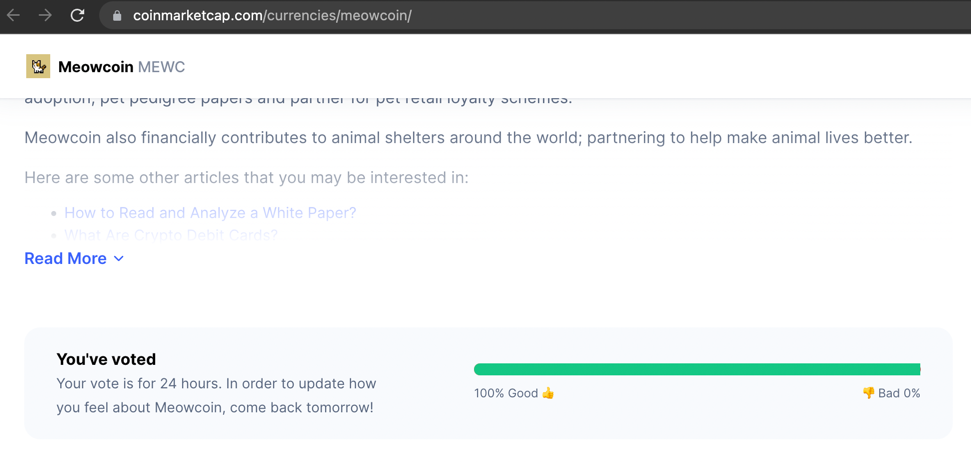

# cmcVoteBot

A vote bot script that everyone can run in computer.    

## Vote the question
[CoinMarketCap Site](https://coinmarketcap.com/)
> How do you feel about USD Coin today?  
> Vote to see community results  

**Let's vote [MEWC](https://coinmarketcap.com/zh-tw/currencies/meowcoin/) to 100% Good**    

## Download

    > git clone https://github.com/gjlmotea/cmcVoteBot

## Install

Please install [node.js](https://nodejs.org/en/download/) first.  
(node.js version must greater than 12).  

After install node, run:  

    > npm install

## Run with node.js

    > node main.js

Now, vote script run~

---

### Donate

If you enjoy this little script, and like to help me out:  

Give me a $MEWC tip  
* my wallet address: `MCJ7H56PrMw2Aq3CD339wi6t7kHQxGuiSs`

Let's promote currency circulation and make $MEWC more valuable.  
After received, **I will send 50% of them to Burn Address**, to reduce the total money supply.      
* [MeowCoin Burn](https://explorer.mewccrypto.com/address/MCBurnXXXXXXXXXXXXXXXXXXXXXXUkdzqy) address: `MCBurnXXXXXXXXXXXXXXXXXXXXXXUkdzqy`

> $MEWC to the moon

